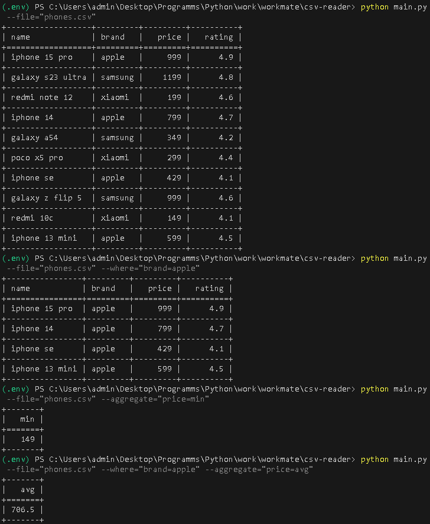

# Обработчки CSV-файлов
Скрипт для обработки CSV-файла, поддерживающий операции:
- фильтрацию с операторами «больше», «меньше» и «равно»;
- агрегацию с расчетом среднего (avg), минимального (min) и максимального (max) значений.

## Структура
- main.py - содержит скрипт;
- phones.csv - файл, использовавшийся для примера;
- handler/handler.py - класс-координатор включает все необходимые для реализации скрипта методы;
- handler/modules - вспомогательные классы, реализующие конкретный функционал: чтение, фильтрацию, агрегацию и вывод;
- tests - юнит-тесты для каждого модуля (кроме вывода).

## Запуск
python main.py --file="path/to/file.csv" [--where="условие"] [--aggregate="операция"]

## Примеры вывода
Вывод, фильтрация, агрегирование и агрегирование с фильтрацией

